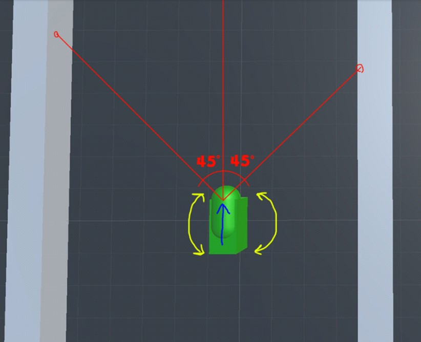
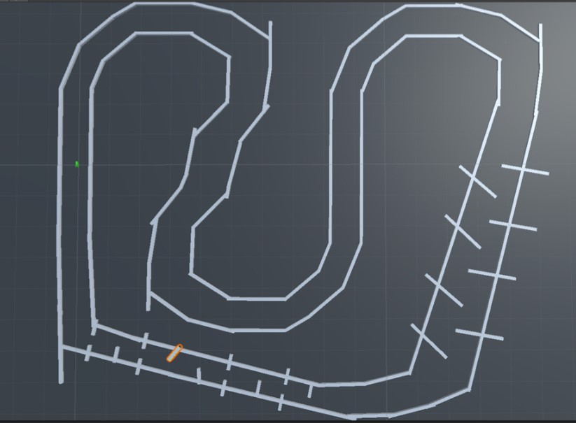
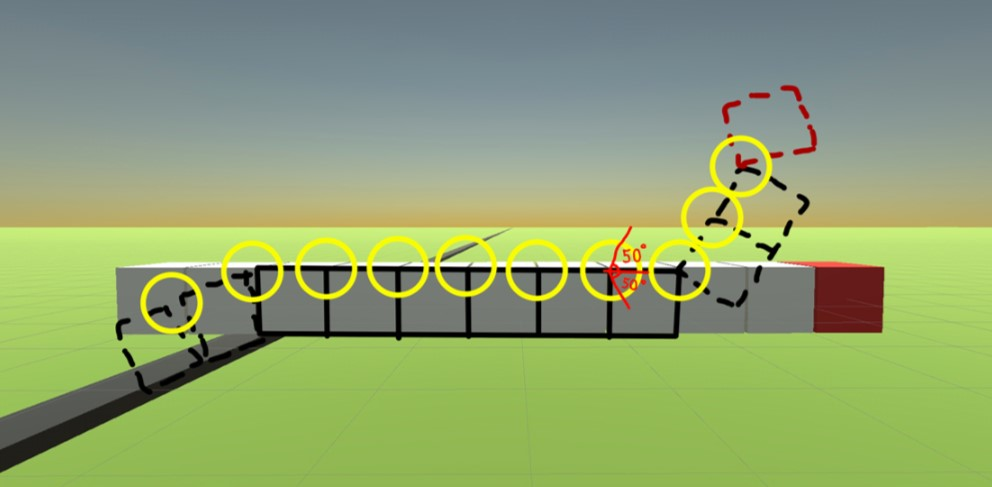

# Описание
Реализация генетического алгоритма для обучения простейших нейронных сетей. 

Для оценки работоспособности было разработано и проведено 2 эксперимента на базе Unity 3d
# 1 Эксперимент
Все обучаемые особи имеют следующий вид. 

Каждый представитель управляется сетью вида перцептрон. На вход сети подается расстояние от стены до тела особи, относительно каждого красного луча. Выход сети: 2 параметра определяющие скорость движения в перёд и скорость поворота вокруг собственной оси.

Значение функции полезности определяется пройденным расстоянием в пределах 60 сек.

Ожидаемый конечный результат: выведение особи способной проходить трассы похожего вида

# 2 Эксперимент
Теперь особи представлены в виде "змей", движение которых происходит за счет сгибания 10 суставов

Нейросеть "змеи" Получает на вход текущий угол сгибания каждого сустава. Выходом являются новые значения сгиба.

Значение функции полезности определяется пройденным расстоянием от стартовой позиции головы до последней зафиксированной в пределах 10 сек.

Ожидаемый конечный результат: Особь способная передвигаться за счет изгибания своего тела. 

# Ссылки
Ссылка на полный проект: https://drive.google.com/file/d/1y086nrWQ6op2-seMr_B4MwgubMUMQ1IR/view?usp=sharing
